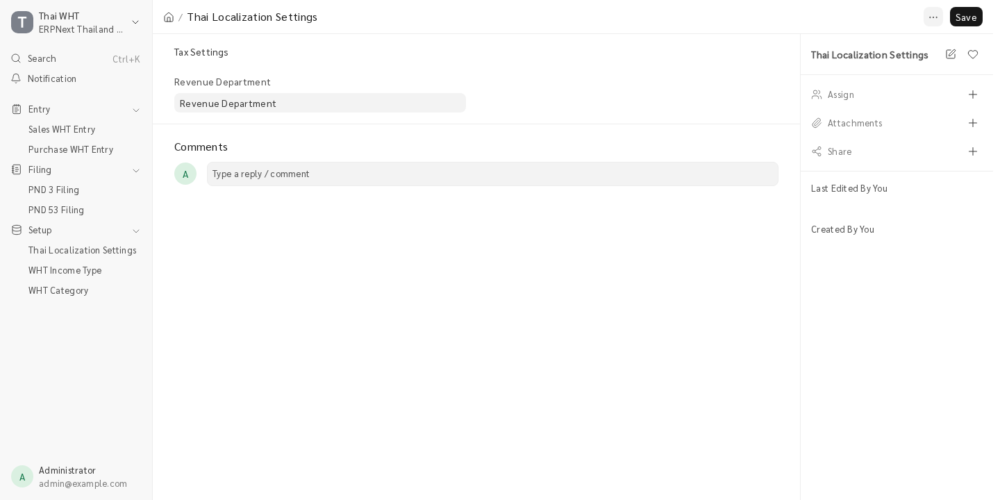
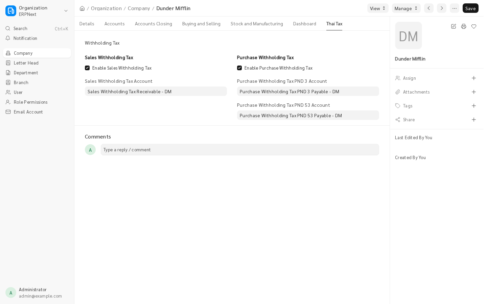
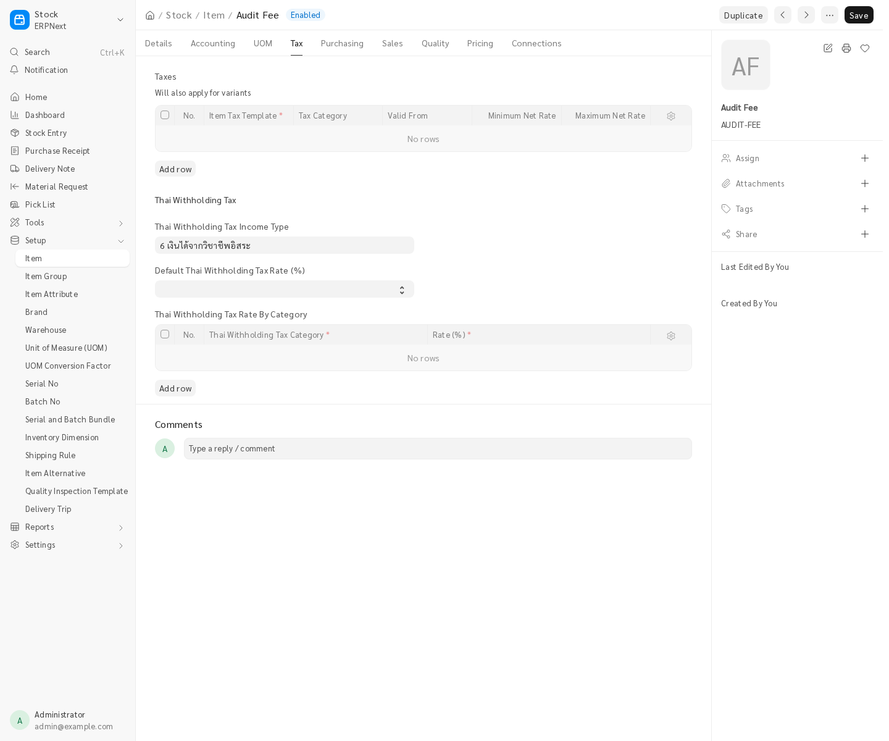
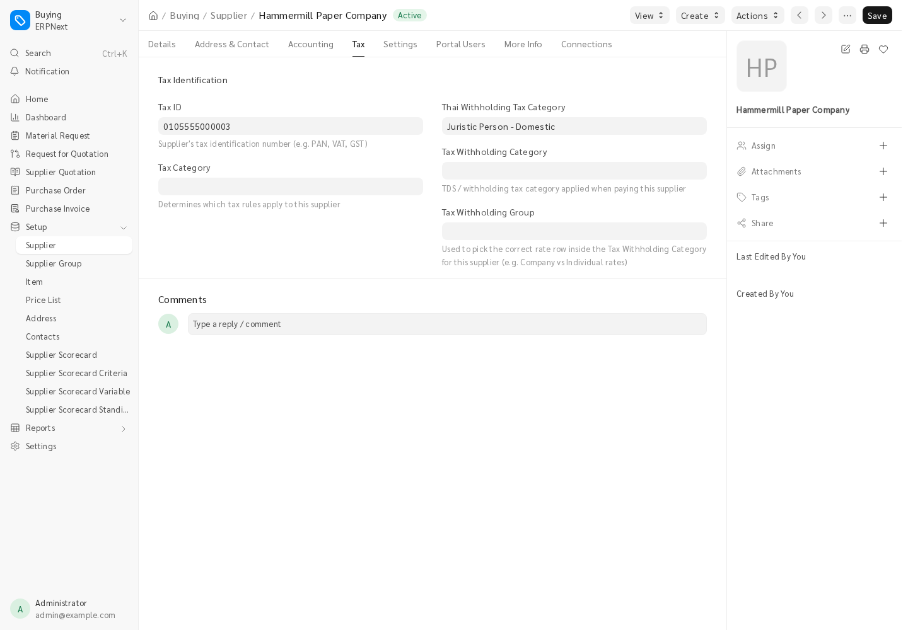
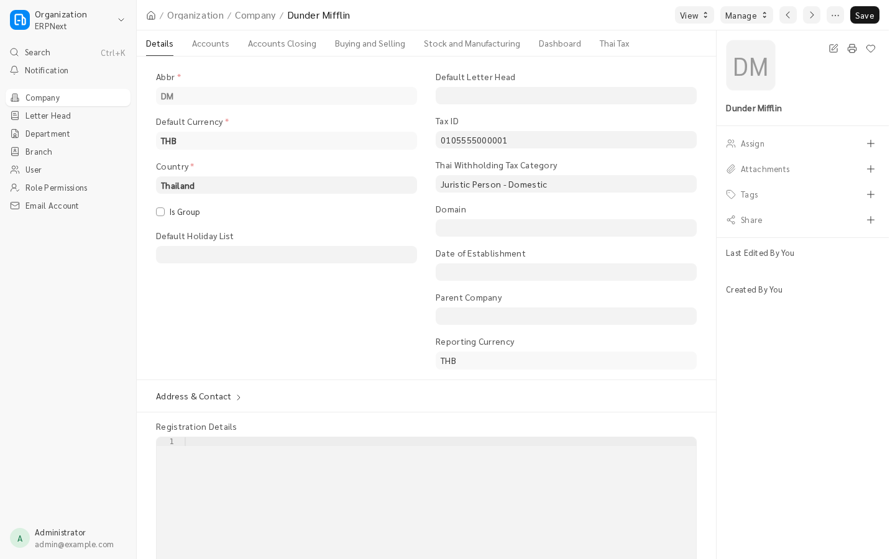

## Preparation

### Create the Required Accounts

* Sales WHT Receivable - Assets / Tax
* Purchase WHT PND 3 - Liability / Tax
* Purchase WHT PND 53 - Liability / Tax

### Create the Revenue Department Supplier

* Revenue Department - Supplier

## Configuration

### Configure the Main Settings

* Open the `Thai Localization Settings` DocType.
* Set the Revenue Department field.

### Configure the Company's Tax Accounts

* Open the `Company` DocType and go to the `Thai Tax` tab.
* Enable Sales WHT and Purchase WHT.
* Select the appropriate WHT accounts.

## Additional Configuration

### Set the Item Income Type and Rate

* Open an `Item` or `Item Group` and go to the Thai Withholding Tax section.
* Set the Thai Withholding Tax Income Type field.
* To override the default rates, set the Thai Withholding Tax Rate (%) or Thai Withholding Tax Rate By Category field.

Related feature:

* How the Withholding Tax Rate Is Resolved

### Set the Supplier's Tax Category

* Open a `Supplier` and go to the `Tax` tab.
* Set the Thai Withholding Tax Category field.
* Set the Tax ID field.

### Set the Company's Tax Category

* Open a `Company` and go to the `Details` tab.
* Set the Thai Withholding Tax Category field.
* Set the Tax ID field.

